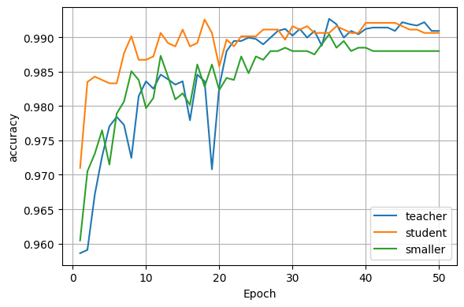
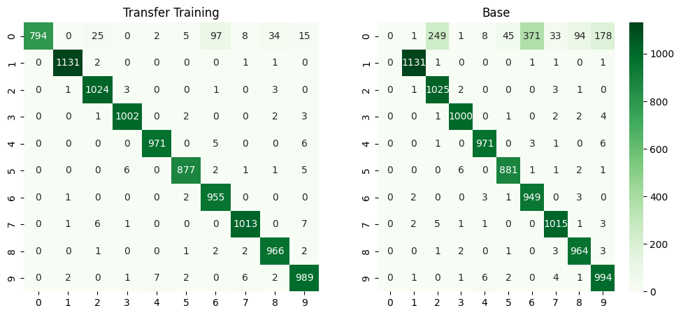
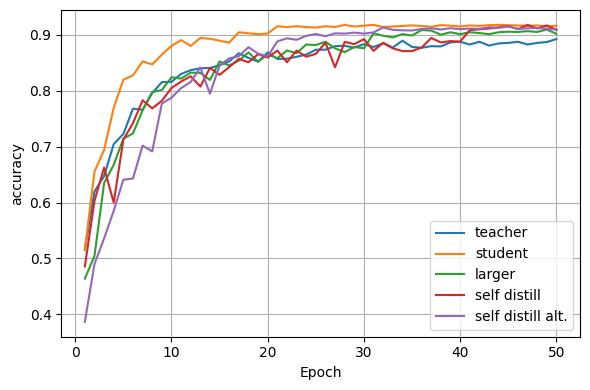
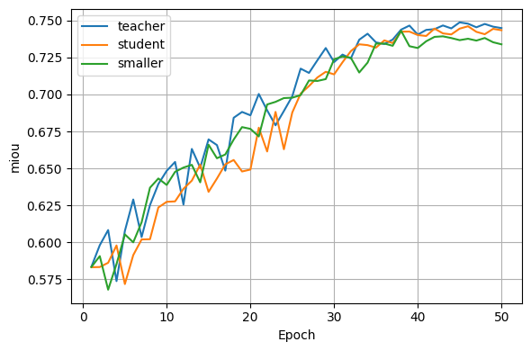
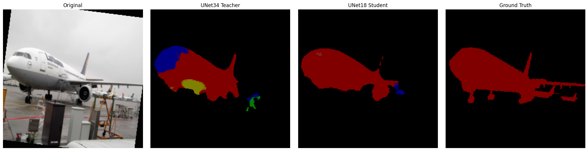

# Neural Network Distillation

At this time DeepSeek has garnered international attention. Utilization of distillation is a particular point of interest behind the success of the parent and children models. This project is intended as a learning exercise to explore the underlying concept of distillation on simpler examples.

Overview of different use cases of distillation on simple problems.

1. Traditional distillation (larger teacher to smaller student)
2. Reverse distillation (smaller teacher to larger student)
3. Self distillation (using embedded shallow classifiers)
4. Self distillation (using previous epoch logits)
5. Transferring feature representations
6. Distillation regularization effect on vision segmentation

## Project Structure

```
project/
│
├── data/
│   ├── cifar10.py               # Dataset loading and preprocessing
│   ├── mnist.py                 # Dataset loading and preprocessing
│   └── voc.py                   # Dataset loading and preprocessing
│
├── models/
│   ├── baseline.py              # MLP
│   ├── unet.py                  # ResNet backbone UNet
│   ├── resnet.py                # ResNet
│   └── resnet_sd.py             # ResNet w/ self distill hook
│
├── utils/
│   ├── plots.py                 # Visual analytics
│   ├── summary.py               # Model summary statistics and code
│   ├── distill.py               # Reusing distillation loops
│   └── train.py                 # Resuing training/evaluation loops
│
├── notebooks/
│   ├── figures.ipynb            # Dataset analysis
│   ├── simplemlp.ipynb          # MNIST models (Note current version may be experimental)
│   ├── resnet.ipynb             # CIFAR models (Note current version may be experimental)
│   ├── unet.ipynb               # VOC models   (Note current version may be experimental)
│   ├── selfdistill.ipynb        # CIFAR models (Note current version may be experimental) (alternate implementation)
│   └── self_distillation.ipynb  # CIFAR models (Note current version may be experimental) (primary implementation)
│
├── requirements.txt             # Project dependencies
└── .gitignore                   # Git ignore file
```

## Installation

```bash
git clone https://github.com/Dodogama/project-compresion.git
cd project-compression
pip install -r requirements.txt
```

## Results

### MLP1200 and MLP800 results on benchmark MNIST classification





### ResNet50 and ResNet34 results on benchmark CIFAR10 classification



### UNet (ResNet34 encoder) and UNet (ResNet18 encoder) on benchmark VOC segmentation





## License

[MIT](LICENSE)
